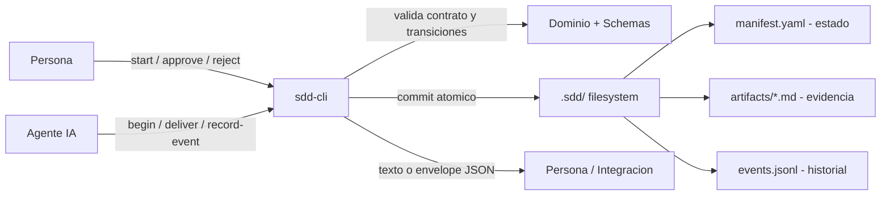
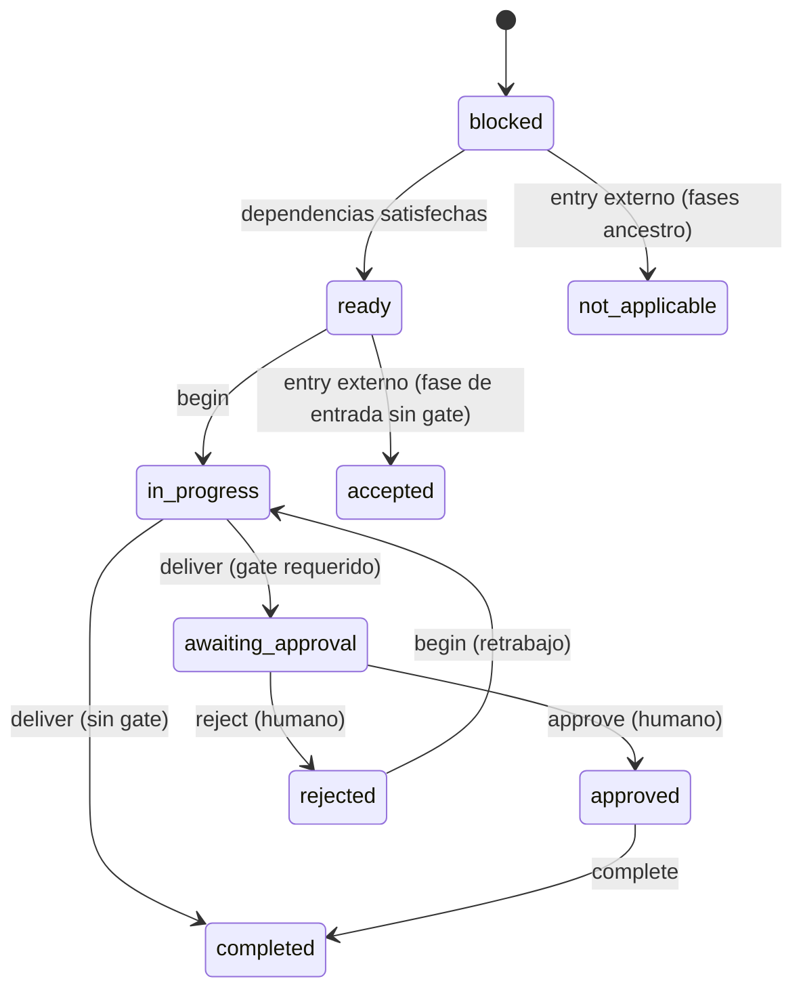

# Flujo de datos y procesos

## Contexto del flujo

<!-- Sistemas, actores y límites que participan en los flujos. -->

Participan tres actores/sistemas alrededor del motor:

- **Persona (humano)**: aprueba o rechaza fases con gate; es el único que puede pasar los
  gates humanos.
- **Agente de IA**: realiza el trabajo cognitivo (redacta, investiga, programa) y le
  informa a la CLI qué hizo (`begin`, `deliver`, `record-event`).
- **`sdd-cli` (motor)**: gobierna el proceso; valida transiciones, exige gates, prepara
  artefactos y persiste estado + eventos en `.sdd/` de forma atómica.

Límite clave: la CLI **no** produce contenido ni ejecuta Git; solo gobierna el proceso y
deja evidencia. El estado vive en el filesystem (`.sdd/`) y Git es la fuente de verdad
última.

## Flujo principal



<!-- Reemplazar el esquema por el flujo verificado del proyecto. -->

## Procesos principales

### Proceso: Setup / Init (`sdd-cli init`) y adapters

- Disparador: usuario ejecuta `sdd-cli init` (y opcionalmente `adapters install <id>`).
- Entradas: directorio destino (`--dir`), recursos embebidos en el binario
  (`embeds/default_sdd`, `embeds/default_adapters`).
- Pasos principales:
  1. Verifica que `.sdd/` no exista (no sobrescribe instalaciones previas).
  2. Desempaqueta el contrato embebido en un directorio de staging, excluyendo
     `work-items/` y `tests/` (fixtures).
  3. Crea `work-items/active/` y `work-items/archive/` con `.gitkeep`.
  4. Publica el staging con un `rename` atómico a `.sdd/`.
  5. `adapters install claude-code`: exige `.sdd/` previo, comprueba todas las colisiones
     antes de escribir (falla sin sobrescribir; no hay `--force`) y publica `CLAUDE.md`,
     `.mcp.json` y `.claude/`.
- Salidas: estructura `.sdd/` lista; adapter instalado. No inicializa Git.
- Errores y reintentos: si `.sdd/` ya existe → error. El staging se limpia ante fallo.

### Proceso: Onboarding de proyecto existente

- Disparador: proyecto existente que quiere adoptar SDD (capability `sdd.onboard-project`).
- Entradas: fuentes del repo (docs + codebase).
- Pasos principales: setup + exploración del repositorio para generar la documentación de
  contexto en `.sdd/context/` (`software-architecture.md`, `project-architecture.md`,
  `data-modeling.md`, `data-and-process-flow.md`, `domain-language.md`).
- Salidas: contexto estable del proyecto (este mismo conjunto de documentos).
- Errores y reintentos: no aplica a nivel motor (lo ejecuta un agente/procedure).

### Proceso: Ciclo de vida de un work item

- Disparador: `sdd-cli start <id>` (con `--workflow` o el default de `config.yaml`).
- Entradas: `id` (kebab-case), `--title`, `--summary`, actor; opcionalmente
  `--from-artifact` + `--phase`.
- Pasos principales:
  1. `start` crea el manifest: todas las fases en `blocked`, la fase de entrada en `ready`
     y, en inicio normal, la arranca automáticamente en `in_progress` (no requiere
     `begin`). Prepara el/los artefacto(s) de la fase de entrada renderizando su template.
  2. Por cada fase: `begin` (→ `in_progress`) y `deliver`. Según el gate:
     `required` → `awaiting_approval`; `optional` → `completed` (o `awaiting_approval` con
     `--request-approval`); `none` → `completed`.
  3. `approve`/`reject` (solo humano) resuelven una fase `awaiting_approval`. Aprobar
     desbloquea las fases cuyas dependencias quedan satisfechas y prepara sus templates en
     el mismo commit. Rechazar reabre con `begin` (retrabajo) sin borrar el historial.
  4. `complete --phase` normaliza `approved`/`accepted` → `completed` (opcional; ambos ya
     satisfacen dependencias).
  5. `complete` (sin `--phase`) cierra el work item a `completed` cuando todas las fases
     obligatorias están satisfechas.
  6. `archive <id>` mueve el expediente a `archive/YYYY-MM-DD-<id>/` (inmutable) si el item
     está `completed`, la fase `archive` está satisfecha (cuando el workflow la declara),
     `validate <id>` no tiene failures y `artifacts/archive.md` es válido.
- Salidas: manifest actualizado (revisión +1 por transición), artefactos y eventos, todo
  confirmado en un único commit transaccional.
- Errores y reintentos: transiciones inválidas → `invalid_transition`; revisión obsoleta →
  `concurrent_modification`; lock tomado → `work_item_locked`. `--operation-id` hace el
  comando idempotente (reintentar no duplica eventos ni reaplica la transición).

### Proceso: Inicio desde artefacto externo (`--from-artifact`)

- Disparador: `sdd-cli start <id> --from-artifact <ruta> --phase <fase>`.
- Entradas: un artefacto Markdown ya escrito; la fase debe ser un entry point del workflow.
- Pasos principales: resuelve el path absoluto y calcula **SHA-256**; importa el contenido
  al artefacto canónico (reemplazando su front-matter por el válido); marca las fases
  ancestro como `not_applicable`; deja la fase de entrada en `accepted` o
  `awaiting_approval` según su gate. Registra evento `phase.bypassed_by_external_input`.
- Salidas: work item que arranca "más adelante", sin saltear fases arbitrariamente.
- Errores: `invalid_external_artifact` si el artefacto no corresponde al entry point o no
  existe; mismatch de hash/artefacto detectado por la validación del manifest.

### Proceso: Validación del contrato y del DAG (`sdd-cli validate`)

- Disparador: `sdd-cli validate` (proyecto) o `validate <id>` (work item). Consulta pura.
- Entradas: `.sdd/` (config, schemas, workflows, templates, procedures, work items).
- Pasos principales: valida JSON Schema + reglas semánticas. Para workflows: orden
  topológico (DAG sin ciclos), entry points no ambiguos, dependencias existentes,
  alcanzabilidad, un artefacto por fase, templates presentes y renderizables. Para work
  items: coherencia manifest↔workflow, estados de fase y aprobaciones.
- Salidas: lista de `ValidationCheck` (`passed`/`warning`/`failed`). Exit code `1` si hay
  failures (las warnings no cambian el exit code).
- Errores y reintentos: no muta estado, no crea locks ni eventos; se puede repetir libremente.

## Secuencias relevantes

```mermaid
sequenceDiagram
    participant Agente
    participant Humano
    participant CLI as sdd-cli
    participant FS as .sdd/ (manifest, artifacts, events)

    Agente->>CLI: begin <id> --phase plan
    CLI->>FS: transicion ready->in_progress (commit atomico)
    Agente->>CLI: deliver <id> --phase plan
    CLI->>FS: plan -> awaiting_approval (+ Approval pending)
    Humano->>CLI: approve <id> --phase plan --by matias
    CLI->>CLI: exige actor human + fase awaiting_approval
    CLI->>FS: plan -> approved; desbloquea implementation (ready) y prepara template
    Agente->>CLI: begin/deliver implementation
    CLI->>FS: implementation -> completed (approval: none)
    Note over CLI,FS: verification (sin gate) -> human-code-review (gate) -> archive (opcional)
    Humano->>CLI: complete <id>
    CLI->>FS: work item -> completed
```

## Ciclo de estados de una fase



## Eventos y comunicación

<!-- Eventos, colas, webhooks o comunicaciones síncronas conocidas. -->

- No hay colas ni webhooks; toda la comunicación es **síncrona vía CLI**.
- Cada operación mutadora agrega uno o más **eventos** append-only a `events.jsonl`
  (`work_item.created`, `work_item_started`, transiciones de fase,
  `phase.bypassed_by_external_input`, y eventos custom vía `record-event`). Cada evento
  lleva `schema_version`, `id`, `at` (RFC3339Nano UTC), `work_item`, `type`, `actor`,
  `data` y `correlation_id` (= `operation-id` cuando se usa).
- El envelope JSON (`--json`) es el canal para que agentes/integraciones consuman
  resultados y errores de forma estructurada.
- Los eventos, junto con el manifest (estado) y los artefactos (evidencia), forman las
  tres fuentes de verdad del work item; Git versiona todo.

## Pendientes y fuentes

- Pendientes o supuestos:
  - Flujos de `cancelled` y propagación de `superseded` no existen como comandos en la
    BETA (Pendiente, `CHANGELOG.md`).
  - El detalle de cómo el adapter/agente encadena los comandos (orquestación) vive en
    `.claude/agents/` y procedures; aquí se documenta el flujo del motor, no la política
    de cada agente (supuesto de alcance).
- Fuentes verificadas:
  - `docs/SDD_WORKFLOW.md`, `docs/CLI.md`.
  - `src/cli/internal/usecases/start_uc.go`, `src/cli/internal/domain/work_item.go`
    (transiciones), `src/cli/internal/infra/{fs_repository.go, project_initializer.go,
    artifact_manager.go}`.
  - `.sdd/workflows/feature-standard.workflow.yaml`, `.sdd/registry/capabilities.yaml`,
    `.sdd/schemas/event.schema.json`.
