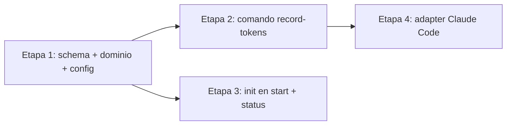

# Plan de implementación: Auditoría y registro de consumo de tokens

## Resumen y contexto

Se habilita la **auditoría de consumo de tokens por work item** (REQ-1..REQ-8). El motor
`sdd-cli` expone un comando público nuevo (`record-tokens`) que persiste, de forma
transaccional y sobrescribiendo el valor previo, los contadores acumulados de una sesión en
`observability.token_usage` del manifest. La *inteligencia de captura* (leer el consumo de la
sesión de Claude Code) vive exclusivamente en el **adapter** mediante un hook `Stop`, que
recalcula el total de la sesión desde el transcript y llama al comando del motor. El motor
permanece limpio de lógica de LLM (RN-1 / RC-3).

**Áreas afectadas:**

| Capa / componente | Archivos principales |
| --- | --- |
| Contrato/schema | `src/.sdd/schemas/work-item.schema.json` (fuente) + embeds vía `go generate` |
| Config | `src/.sdd/config.yaml`, `src/cli/internal/domain/config.go`, `src/cli/internal/infra/config_repository.go` |
| Dominio | `src/cli/internal/domain/work_item.go`, `domain/errors.go` |
| Casos de uso | nuevo `usecases/record_tokens_uc.go`, `usecases/start_uc.go` |
| Presentación CLI | nuevo `cmd/record_tokens.go`, `cmd/composition.go`, `cmd/root.go`, `cmd/status.go` |
| Adapter Claude Code | nuevo hook + `settings.json` + instrucciones de skills/agentes + script de prueba manual |
| Embeds/distribución | `go generate ./...` (syncsdd + syncadapters) |

**Esfuerzo estimado: `medium-high`.** El motor toca 4 capas pero reutilizando patrones ya
existentes (poco riesgo). El adapter concentra la complejidad real (hooks + parsing de
transcript + resolución de work item + logging), pero es aislable y verificable.

> **Premisa de trabajo (directiva del orquestador):** los scripts/hooks previos del runtime
> `.claude/` NO son baseline ni referencia. Todo el diseño del hook, scripts, `.active-work-item`
> y logging se propone **desde cero**, guiado sólo por la especificación aprobada y las notas
> del usuario. Sí se apoya en investigación empírica del mecanismo de hooks (D-2, abajo).
>
> **Alcance de edición (directiva del usuario):** la feature modifica **únicamente la fuente del
> framework** — `src/.sdd/` (contrato/template), `src/cli/` (código) y `src/adapters/claude-code/`
> (adapter) — y regenera los embeds con `go generate`. La `/.sdd` **raíz NO se edita**: es una
> **instalación** de una versión (dogfooding de este repo), no código fuente. Verificado
> (`schema_validator.go:109`): el motor en runtime valida contra `baseDir/.sdd/schemas`, y el
> schema embebido (desde `src/.sdd`) sólo se usa al instalar/`init` un proyecto nuevo. Si se
> quiere dogfoodear la feature en este repo, la `/.sdd` raíz se **reinstala** desde el build nuevo;
> activar la auditoría es editar manualmente `token_usage` en el `config.yaml` de esa instalación
> (D-3), lo cual es "usar el install", no un cambio de fuente.

---

## D-2 — Investigación empírica del mecanismo de hooks (cierra el supuesto S-1)

Verificado contra documentación oficial (`code.claude.com/docs/en/hooks`) y contra un
transcript real de este entorno (`~/.claude/projects/<slug>/<session-id>.jsonl`).

**Conclusión: S-1 es VÁLIDO. Los hooks post-turno existen y exponen el consumo de la sesión.**

1. **Evento de disparo.** Existe el hook `Stop` (fin de turno del agente principal) y
   `SubagentStop` (fin de subagente). El diseño usa **`Stop`** como disparador primario: al
   finalizar el turno principal, los mensajes de subagentes ya están en el transcript, por lo
   que un solo `Stop` captura *toda la sesión* (REQ-5).
2. **Entrada del hook (stdin JSON):** incluye `session_id`, `transcript_path`, `cwd`,
   `hook_event_name`, `stop_hook_active`, `permission_mode`. El `transcript_path` se recibe
   directo: no hay que adivinar la ruta.
3. **Transcript:** JSONL en `~/.claude/projects/<slug>/<session-id>.jsonl`. Cada mensaje del
   asistente trae `message.usage` con — verificado empíricamente —:
   `input_tokens`, `output_tokens`, `cache_read_input_tokens`, `cache_creation_input_tokens`.
   Los mensajes de subagentes aparecen en el mismo archivo con `isSidechain: true`.
4. **Cálculo del total de sesión (mapeo a schema):**
   - `input_tokens`  = Σ `usage.input_tokens`
   - `output_tokens` = Σ `usage.output_tokens`
   - `cache_read_tokens`  = Σ `usage.cache_read_input_tokens`
   - `cache_write_tokens` = Σ `usage.cache_creation_input_tokens`
   - `total_tokens` = suma de los cuatro (lo calcula el **motor**, ver Decisión D-a).
5. **Variables de entorno:** `${CLAUDE_PROJECT_DIR}` = raíz del proyecto/worktree donde inició
   la sesión → se usa para localizar `.active-work-item` (RC-6) y ejecutar `sdd-cli --dir`.
6. **Exit codes:** `0` = éxito (Claude lee JSON de stdout); `2` = **bloquea** el stop. El hook
   de tokens **nunca debe bloquear**: ante cualquier error registra en log y **sale con 0**.
7. **Limitación documentada oficialmente:** el transcript se escribe de forma *asíncrona* y
   puede ir por detrás del último mensaje. Esto **no afecta la integridad** por el diseño
   acumulativo por recálculo (RN-3 / D-4): si el último turno aún no está en disco, el próximo
   `Stop` recalcula y sobrescribe el total completo. Queda como limitación menor de v1.

---

## Enfoque y decisiones

### Arquitectura y patrones (SOLID / Clean Architecture)

El repo ya aplica **Arquitectura Hexagonal / Ports & Adapters** con capas
`domain → usecases → ports → infra` + `cmd` (composición). **No se introduce ningún patrón
nuevo**: se replican los patrones existentes (Command de Cobra, UseCase por operación,
Repository por puerto, transacción staging+fsync+rename+backup). Introducir un patrón adicional
sería complejidad injustificada.

**Reutilización antes de crear (verificado):**
- Se reutiliza la transacción atómica existente (`FSWorkItemRepository.CommitWorkItem`) para
  RC-4 — no se crea persistencia nueva.
- Se reutilizan los helpers `commitWorkItem`, `newOperationEvent`, `operationApplied`
  (`usecases/transition_helpers.go`) — el nuevo caso de uso es un ensamblado delgado, análogo a
  `RecordEventUseCase`.
- Se reutiliza la estructura `observability.token_usage` ya modelada en schema y dominio
  (S-2 confirmado): sólo se **agrega** `total_tokens` (aditivo).
- El comando nuevo replica la forma de `cmd/record_event.go`.
- El hook nuevo replica convenciones de los hooks Python existentes (`protect-secrets.py`):
  Python3, `${CLAUDE_PROJECT_DIR}`, entrada por stdin.

### Decisiones de diseño

**D-a — El total lo calcula el motor, no el llamador.** El comando recibe los 4 contadores y
computa `total_tokens = input+output+cache_read+cache_write` antes de persistir. Refuerza la
invariante RC-1 en un único lugar (SRP) y evita que un total inconsistente entre por parámetro.
*Alternativa descartada:* aceptar `total_tokens` como flag → riesgo de inconsistencia y
duplicación de la regla.

**D-b — La regla de negocio del registro vive en el dominio.** Se añade
`WorkItem.RecordTokenUsage(...)` que valida "auditoría activa", calcula el total, sobrescribe los
contadores y fija `status="recorded"`. El caso de uso queda como orquestador de I/O (carga →
método de dominio → commit + evento). *Alternativa descartada:* poner la lógica en el use case →
filtraría reglas de negocio fuera del dominio.

**D-c — Detección de "auditoría activa".** Un item tiene auditoría **activa** ⇔
`observability.token_usage != nil` **y** `status ∈ {partial, recorded}`. **Inactiva** ⇔
`token_usage == nil` **o** `status == not_reported`. Cubre tanto ítems inicializados inactivos
(REQ-2) como ítems preexistentes sin el campo (E-11/E-12). Registrar sobre inactivo →
`ErrTokenAuditInactive` (error manejable, D-7).

**D-d — Config binaria tolerante (M-1 / D-3).** `observability.token_usage` pasa a semántica
booleana (`true`/`false`). Se parsea con un unmarshal **tolerante**: `true` → activa; `false`,
ausente o valor legado (`optional` u otro string) → inactiva. Así el cambio de valor **nunca
rompe** el parseo de configs existentes (satisface "no romper el parseo", RC-5) y respeta que la
activación sea edición manual del usuario (D-3). El template por defecto pasa a `false`.
*Alternativa descartada:* exigir booleano estricto → un `optional` heredado rompería todos los
comandos.

**D-e — Identidad del adapter como fuente única (RC-8).** El script del hook define **una sola
constante `ADAPTER_ID`** cuyo valor es el `id` del `adapter.yaml` (para Claude Code: `claude-code`).
Esa constante se reutiliza para **todo** lo que identifique al agente de código: el `--source` del
comando y el nombre del archivo de log (D-g). **No** se hardcodea el literal en múltiples lugares.
El motor almacena verbatim el `source` recibido (E-01 es passthrough) y es agnóstico del adapter,
por lo que un futuro adapter (p. ej. `github-copilot`) trae su propio script con su propio
`ADAPTER_ID` y el mismo patrón funciona sin cambios en el motor.

**D-f — `operation-id` por turno (RC-9).** El hook genera
`operation-id = "tokens:<session_id>:<N>"` donde `N` = cantidad de mensajes de asistente
contados en el transcript. Un reintento del **mismo** turno es idempotente (mismo N → evento no
se duplica); un turno **nuevo** difiere (N mayor → nuevo registro que sobrescribe). Cumple el
patrón `operationIDPattern` del motor (permite `:`).

**D-g — Ubicación y formato del log de errores (cierra D-6 / RC-7).**
- **Ruta:** `${CLAUDE_PROJECT_DIR}/.claude/hooks/token-usage/logs/` (dentro del worktree,
  co-ubicado con el hook, fuera del árbol gobernado `.sdd/` para no interferir con la transacción
  del motor).
- **Nombre:** `token-usage-error-<UTC-ISO8601>-<ADAPTER_ID>.log` (un archivo por incidente,
  siguiendo la sugerencia del usuario `log-<timestamp>-claude_code`). El `<ADAPTER_ID>` **no** es
  un literal: sale de la constante única del adapter (D-e), de modo que un futuro adapter
  (`github-copilot`) genere `...-github-copilot.log` sin más cambios.
- **Contenido (texto plano):** timestamp UTC, `hook_event_name`, `session_id`, `work_item`
  resuelto (o motivo de fallo de resolución), código/tipo de error, mensaje del motor
  (incluida la salida JSON de `sdd-cli` cuando aplica, D-7) y contexto relevante.
- **Retención:** v1 conserva todos los archivos; limpieza manual (limitación menor documentada).
  El directorio se agrega a `.gitignore` del adapter.

**D-h — Disparador `Stop` (no `PostToolUse`).** Correcto por granularidad (fin de turno) y porque
la integridad no depende del punto exacto (D-4). No se registra `SubagentStop` por separado: es
redundante (el `Stop` posterior recalcula igual) y evitarlo reduce escrituras; se documenta como
opción de resiliencia futura.

### Cumplimiento SOLID / Clean Code por archivo tocado

| Archivo | Validación |
| --- | --- |
| `domain/work_item.go` | SRP: `RecordTokenUsage` encapsula la invariante; sin dependencias de infra. |
| `domain/config.go` | Sólo estructura + unmarshal tolerante; sin lógica de negocio. |
| `usecases/record_tokens_uc.go` | Depende de puertos (DIP); orquesta, no decide reglas (delega en dominio). |
| `usecases/start_uc.go` | Cambio mínimo aditivo (pasa flag de config); no altera flujos existentes. |
| `cmd/record_tokens.go` | Espejo de `record_event.go`; sólo mapea flags → use case. |
| `cmd/status.go` | Añade impresión de un bloque; no cambia la lógica de estado. |
| hook Python | Función única (capturar y delegar); sin lógica de motor (RC-3); nunca bloquea. |

---

## Etapas de implementación

Cambio complejo → se divide en 4 etapas por **orden de dependencia**. La Etapa 1 es cimiento;
las Etapas 2 y 3 dependen sólo de la 1 y son **independientes entre sí (paralelizables** en dos
developers); la Etapa 4 requiere el comando de la Etapa 2.



### Etapa 1 — Fundaciones: schema, dominio y config
_Trazabilidad: A-8, D-1, RC-1, REQ-4, REQ-2, REQ-3, RC-2, M-1, D-3._

**Objetivo:** que el modelo de datos, la invariante de registro y la lectura de config existan y
sean válidos, sin exponer aún comando ni captura.

Tareas (ordenadas):

1. **Schema `total_tokens` (aditivo).** En `src/.sdd/schemas/work-item.schema.json`, `$defs.
   observability.token_usage.properties`, agregar
   `"total_tokens": { "type": ["integer","null"], "minimum": 0 }`. Es opcional/nullable → no
   rompe manifests existentes. **Sólo se edita la fuente `src/.sdd`**; los embeds se regeneran con
   `go generate` (ver tarea de sincronización). La `/.sdd` raíz (instalación) no se toca.
2. **Dominio `TokenUsage`.** En `domain/work_item.go` agregar el campo:
   ```go
   TotalTokens *int `json:"total_tokens,omitempty" yaml:"total_tokens,omitempty"`
   ```
   (Puntero → un `*int` a 0 se serializa como `0`; sólo `nil` se omite. Coherente con E-02: los
   contadores activos en 0 se persisten como 0.)
3. **Inicialización al crear (REQ-2).** En `NewWorkItemParams` agregar `TokenAuditActive bool`.
   En `NewWorkItem`, tras construir `item`, inicializar `item.Observability`:
   - activa → `status:"partial"`, los 5 contadores en `0` (punteros a 0), `source:nil`.
   - inactiva → `status:"not_reported"`, los 5 contadores `nil`, `source:nil`.
4. **Método de dominio (REQ-1/REQ-3/RC-1/RC-2).**
   ```go
   func (item *WorkItem) RecordTokenUsage(in, out, cacheRead, cacheWrite int, source string) error {
     // audit activa? si no -> ErrTokenAuditInactive
     // validar >=0 y source != "" -> ErrValidationFailed
     // total := in+out+cacheRead+cacheWrite
     // sobrescribir los 5 contadores + source + status="recorded"
   }
   ```
5. **Errores.** En `domain/errors.go` agregar `ErrTokenAuditInactive`. (Se reutiliza
   `ErrValidationFailed` para valores inválidos, ya mapeado a `validation_failed`, E-06.)
6. **Config (M-1/D-3).** En `domain/config.go` agregar:
   ```go
   Observability ConfigObservability `json:"observability" yaml:"observability"`
   // ConfigObservability{ TokenUsage TokenUsageSetting }
   // TokenUsageSetting bool con UnmarshalYAML tolerante (true->true; resto->false)
   // método Config.TokenAuditActive() bool
   ```
   Sin cambios obligatorios en `config_repository.go` (el unmarshal lo resuelve la estructura);
   opcionalmente exponer helper. Actualizar **sólo el template fuente** `src/.sdd/config.yaml` de
   `token_usage: optional` a `token_usage: false`. La `/.sdd/config.yaml` raíz (instalación) no se
   edita como parte de la feature; su valor lo gestiona el usuario en su install (D-3).
7. **Resultado esperado:** compila; un manifest con `total_tokens` valida contra el schema; un
   config `false`/`optional`/ausente se parsea a inactiva; `true` a activa.

**Pruebas Etapa 1:** unit en `domain` para `NewWorkItem` (activa→partial+0s; inactiva→
not_reported+nulls) y `RecordTokenUsage` (éxito/overwrite, inactiva→error, negativos→error,
todos en 0 válido E-09, total = suma). Unit para el unmarshal tolerante de config
(true/false/optional/ausente).

### Etapa 2 — Comando público del motor `record-tokens`
_Trazabilidad: REQ-1, A-1, CA-4, RC-4, RC-9, E-01, E-05, E-06, E-09, E-12, D-7._

**Objetivo:** exponer el contrato público para registrar tokens manual o vía adapter.

Tareas:

1. **Caso de uso** `usecases/record_tokens_uc.go` (espejo de `record_event_uc.go`), depende de
   `ports.WorkItemMutationRepository`, `Clock`, `IDGenerator`. Flujo:
   carga item → `operationApplied` (idempotencia) → `item.RecordTokenUsage(...)` →
   `newOperationEvent("tokens.recorded", …, data={input,output,cache_read,cache_write,total,source})`
   → `commitWorkItem`. Los errores de dominio se propagan tal cual (manejables).
2. **Comando** `cmd/record_tokens.go`:
   `record-tokens <work-item-id> --input-tokens --output-tokens --cache-read-tokens
   --cache-write-tokens --source [--operation-id] [--actor-kind --actor-id]`.
   `total` NO es flag (D-a). Marcar requeridos los 4 contadores y `--source`.
3. **Cableado:** agregar `RecordTokens *usecases.RecordTokensUseCase` a `Application`
   (`cmd/composition.go`) y registrar el comando en `cmd/root.go`.
4. **Mapeo de error** en `cmd/root.go` `errorCode`: `ErrTokenAuditInactive` →
   `"token_audit_inactive"` (código nuevo, error manejable).
5. **Resultado esperado:** `sdd-cli record-tokens <id> --json ...` sobrescribe contadores y deja
   `status:recorded`; sobre item inactivo devuelve JSON `success:false` code
   `token_audit_inactive`; negativos → `validation_failed`; el manifest queda intacto ante error
   (RC-4, garantizado por la transacción existente).

**Pruebas Etapa 2:** e2e en `cmd/cli_e2e_test.go`: registro exitoso + overwrite (E-01);
respaldo manual (E-05); inactivo → error manejable (E-12/E-03); negativo → validation_failed
manifest intacto (E-06); todos en 0 (E-09); idempotencia con mismo `--operation-id` (RC-9, no
duplica evento) y no-idempotencia con operation-id distinto.

### Etapa 3 — Integración en creación y visibilidad en `status`
_Trazabilidad: REQ-2, M-2, E-02, E-03, E-11, A-7, CA-3, E-10._

**Objetivo:** que crear un work item inicialice el campo según config, y que el consumo sea
consultable sin leer el YAML. (Independiente de la Etapa 2.)

Tareas:

1. **`start_uc.go`:** cargar config **siempre** (hoy sólo si `WorkflowID==""`) y pasar
   `TokenAuditActive: cfg.TokenAuditActive()` en `NewWorkItemParams`. Cuidar no romper el flujo
   de `--from-artifact`.
2. **`cmd/status.go`:** añadir al printer de texto un bloque "Token usage" con `status`,
   `source`, `input/output/cache_read/cache_write/total` cuando `Observability.TokenUsage != nil`.
   La salida `--json` ya expone el campo (StatusResult embebe `*domain.WorkItem`). `status` ya
   resuelve activos y archivados (FindWorkItem) → cubre CA-3.
3. **Resultado esperado:** con auditoría activa, un item recién creado muestra `partial` + ceros
   (E-02); inactiva → `not_reported` + nulls (E-03); ítems previos sin el campo no se tocan
   (E-11); `status` (texto y JSON) muestra el consumo (E-10).

**Pruebas Etapa 3:** e2e: crear con config activa (manifest partial+0s) y con inactiva
(not_reported+null); `status --json` incluye `observability.token_usage`; texto imprime el bloque.

### Etapa 4 — Adapter Claude Code (captura automática)
_Trazabilidad: A-4, A-5, A-6, REQ-5, REQ-6, REQ-7, RC-6, RC-7, RC-8, E-07, E-08, D-2, D-6, D-7._

**Objetivo:** capturar el consumo de la sesión y delegar en el comando del motor, con resolución
del work item y logging diagnosticable. **Requiere la Etapa 2.**

Tareas (todas bajo la fuente de verdad `src/adapters/claude-code/`, luego sync a embeds):

1. **Hook Python** `.claude/hooks/token-usage/record-token-usage.py`:
   - Lee stdin JSON (`transcript_path`, `session_id`, `cwd`).
   - Resuelve raíz del worktree por `${CLAUDE_PROJECT_DIR}`; lee `.active-work-item` (RC-6):
     valida kebab-case (`^[a-z0-9]+(?:-[a-z0-9]+)*$`); si ausente/vacío/malformado → log + exit 0
     (E-08).
   - Parsea el transcript JSONL y suma `message.usage` de todos los mensajes de asistente
     (incluye `isSidechain`) → mapeo del punto D-2.4 (REQ-5).
   - Ejecuta `sdd-cli record-tokens <id> --input-tokens … --source <ADAPTER_ID>
     --operation-id tokens:<session_id>:<N> --json --dir <CLAUDE_PROJECT_DIR>` (donde
     `ADAPTER_ID` es la constante única del adapter, D-e; aquí `claude-code`).
   - Interpreta el JSON de salida; ante `success:false` (incl. `token_audit_inactive`, D-7) o
     excepción/`sdd-cli` no encontrado → escribe log (D-g) y **exit 0** (nunca bloquea).
2. **`settings.json`** del adapter: registrar el hook `Stop` (`matcher:"*"`, `type:"command"`,
   `python3 "${CLAUDE_PROJECT_DIR}/.claude/hooks/token-usage/record-token-usage.py"`,
   `timeout` razonable). No tocar los hooks `PreToolUse` de seguridad existentes.
3. **Ciclo de vida de `.active-work-item` (RC-6, REQ-7).** Es responsabilidad del flujo/adapter,
   no del motor. Actualizar instrucciones (prosa) para que se cree/actualice en el **primer
   turno**:
   - `skills/git-worktree/SKILL.md`: al aprovisionar el worktree, escribir `.active-work-item`
     con el id en la raíz del worktree.
   - `agents/sdd-orchestrator.md`: para cambios chicos sin worktree, garantizar `.active-work-item`
     en la raíz en el primer turno. Documentar la **condición de uso R-1/RN-5** (una sesión ↔ un
     work item por rama/worktree) y la limitación del primer turno previo a su creación (v1).
4. **Logging** (D-g): crear dir de logs; agregar patrón a `.claude/.gitignore`.
5. **Script de prueba manual** `.claude/hooks/token-usage/test-record-token-usage.sh` (o `.py`):
   fabrica un transcript JSONL de muestra + `.active-work-item` + un proyecto `.sdd` temporal con
   un work item activo, ejecuta el hook y verifica que el manifest quedó actualizado. Cubrir edge
   cases reales: `.active-work-item` ausente, id inexistente, auditoría inactiva, transcript
   vacío/parcial.
6. **Sincronización de embeds:** ejecutar `go generate ./...` desde `src/cli` (corre `syncsdd` y
   `syncadapters`) para propagar cambios de `src/.sdd` y `src/adapters` a `src/cli/embeds`.
7. **Resultado esperado:** al finalizar un turno con auditoría activa, el manifest del work item
   apuntado por `.active-work-item` refleja el total de la sesión; aislamiento entre worktrees
   (E-07); errores diagnosticables sin romper la sesión (E-06/E-08/E-12).

---

## Archivos o áreas afectadas (detalle)

**Motor (`src/cli`):**
- `internal/domain/work_item.go` — campo `TotalTokens`, init en `NewWorkItem`, método
  `RecordTokenUsage`, `NewWorkItemParams.TokenAuditActive`.
- `internal/domain/config.go` — `Observability`/`TokenUsageSetting` + `TokenAuditActive()`.
- `internal/domain/errors.go` — `ErrTokenAuditInactive`.
- `internal/usecases/record_tokens_uc.go` — **nuevo**.
- `internal/usecases/start_uc.go` — carga config + pasa flag.
- `cmd/record_tokens.go` — **nuevo**; `cmd/composition.go`, `cmd/root.go`, `cmd/status.go`.
- Tests: `domain/*_test.go`, `usecases/*_test.go`, `cmd/cli_e2e_test.go`.

**Contrato/config (SÓLO fuente + embeds; la `/.sdd` raíz NO se toca):**
- `src/.sdd/schemas/work-item.schema.json`.
- `src/.sdd/config.yaml`.
- `src/cli/embeds/default_sdd/**` y `src/cli/embeds/default_adapters/**` (regenerados vía `go generate`).

**Adapter (`src/adapters/claude-code`):**
- `.claude/hooks/token-usage/record-token-usage.py` — **nuevo**.
- `.claude/hooks/token-usage/test-record-token-usage.sh` — **nuevo**.
- `.claude/settings.json` — hook `Stop`.
- `.claude/.gitignore` — patrón de logs.
- `.claude/skills/git-worktree/SKILL.md`, `.claude/agents/sdd-orchestrator.md` — `.active-work-item`
  y condición de uso.

---

## Estrategia de pruebas

**Unit (dominio):** inicialización activa/inactiva (E-02/E-03); `RecordTokenUsage`
overwrite/total/negativos/cero/inactiva (E-01/E-06/E-09/E-12); unmarshal tolerante de config
(D-d).

**Use case:** `RecordTokensUseCase` con repos fake (patrón de `usecases_test.go`): éxito,
idempotencia por `operation-id` (RC-9), propagación de `ErrTokenAuditInactive`.

**E2E CLI (`cli_e2e_test.go`):** E-01, E-05, E-06, E-09, E-12, `status` con tokens (E-10),
creación con config activa/inactiva (E-02/E-03), y verificación de que un error deja el manifest
intacto (RC-4).

**Adapter (manual + real):** script de prueba que ejercita el hook contra un `.sdd` temporal con
transcript de muestra; edge cases: `.active-work-item` ausente/ inválido (E-08), auditoría
inactiva (E-12/D-7), transcript parcial (D-2.7), aislamiento por worktree (E-07).

**Tests existentes a revisar:** los de `start`/`status`/`NewWorkItem` — actualizar asserts para
el nuevo campo `observability` inicializado (evitar regresiones por el bloque agregado). Los del
schema/manifest deben seguir pasando por ser el cambio aditivo.

---

## Riesgos, rollback y dependencias

**Supuestos:**
- Una sesión ↔ un work item por rama/worktree (RN-5/R-1): responsabilidad del usuario,
  documentada; el sistema no la impone.
- `.active-work-item` existe desde el primer turno (limitación v1: el turno previo a su creación
  no se contabiliza, D-2/RN-7).

**Riesgos y mitigación:**

| Riesgo | Mitigación |
| --- | --- |
| Parseo estricto de config rompe proyectos con `token_usage: optional` | Unmarshal tolerante (D-d): cualquier valor no-`true` → inactiva. |
| `omitempty` omite contadores en 0 | Uso de `*int`; un puntero a 0 se serializa como `0` (verificado en el modelo). |
| Hook bloquea la sesión ante error | El hook **siempre** sale con 0; sólo `Stop` con exit 2 bloquea, y no se usa. |
| Transcript asíncrono desfasado | Diseño acumulativo por recálculo (RN-3): el próximo turno recupera el total. |
| Confundir fuente con instalación | Se edita **sólo** `src/.sdd` + `go generate`; la `/.sdd` raíz es un install y no se toca. Dogfooding = reinstalar desde el build nuevo. |
| `operation-id` fijo dedup los turnos siguientes | `operation-id` por turno con `N` del transcript (D-f). |
| Contaminación cruzada entre worktrees | `.active-work-item` por worktree + `--dir ${CLAUDE_PROJECT_DIR}` (E-07). |

**Dependencias:** ninguna externa nueva (se usa `python3` ya presente por los hooks existentes y
`jq` no es necesario si el parseo se hace en Python). El comando del motor no depende del adapter.

**Rollback:** el cambio es aditivo y desactivable. Para revertir sin desplegar: fijar
`observability.token_usage: false` (ítems nuevos quedan `not_reported`; los existentes no se
tocan) y remover el hook `Stop` de `settings.json`. Revert de código: los commits de cada etapa
son independientes; el schema `total_tokens` es nullable/opcional, por lo que quitarlo no
invalida manifests que ya lo tengan salvo que se registre estrictamente `additionalProperties:
false` (queda como nota: si se revierte el schema, primero limpiar el campo de manifests activos).

---

## Trazabilidad plan → especificación

| Etapa/Tarea | Ítems de especificación |
| --- | --- |
| E1 | A-8, D-1, RC-1, REQ-4, REQ-2, REQ-3, RC-2, M-1, D-3 |
| E2 | REQ-1, A-1, CA-4, RC-4, RC-9, E-01, E-05, E-06, E-09, E-12, D-7 |
| E3 | REQ-2, M-2, E-02, E-03, E-11, A-7, CA-3, E-10 |
| E4 | A-4, A-5, A-6, REQ-5, REQ-6, REQ-7, RC-6, RC-7, RC-8, E-07, E-08, D-2, D-6 |
| RC-3 (motor limpio) | Transversal: la captura vive sólo en el hook (E4); el motor sólo persiste (E2) |
